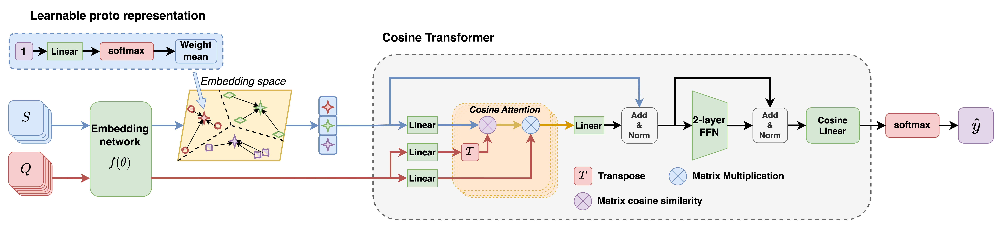

# Enhancing Few-shot Image Classification with Cosine Transformer
This repo contains the official implementation code for the paper [**Enhancing Few-shot Image Classification with Cosine Transformer**](). In this project, we develop a transformer-based method for few-shot classification with an improved cross-attention mechanism based on cosine similarity.
## Table of Content
- [Enhancing Few-shot Image Classification with Cosine Transformer](#enhancing-few-shot-image-classification-with-cosine-transformer)
  - [Table of Content](#table-of-content)
  - [Abstract](#abstract)
  - [Experiments](#experiments)
    - [Dependencies environment](#dependencies-environment)
    - [Dataset](#dataset)
    - [Running scripts](#running-scripts)
  - [Results](#results)
  - [References](#references)
  - [Acknowledgment](#acknowledgment)
  - [Citation](#citation)
  - [Contact](#contact)
## Abstract
> *This paper addresses the few-shot image classification problem. One notable limitation of few-shot learning is the variation in describing the same category, which might result in a significant difference between small labeled support and large unlabeled query sets. Our approach is to obtain a relation heatmap between the two sets in order to label the latter one in a transductive setting manner. This can be solved by using cross-attention with the scaled dot-product mechanism. However, the magnitude differences between two separate sets of embedding vectors may cause a significant impact on the output attention map and affect model performance. We tackle this problem by improving the attention mechanism with cosine similarity. Specifically, we develop FS-CT (Few-shot Cosine Transformer), a few-shot image classification method based on prototypical embedding and transformer-based framework. The proposed Cosine attention improves FS-CT performances significantly from nearly 5% to over 20% in accuracy compared to the baseline scaled dot-product attention in various scenarios on three few-shot datasets mini-ImageNet, CUB-200, and CIFAR-FS. Additionally, we enhance the prototypical embedding for categorical representation with learnable weights before feeding them to the attention module. Our proposed method FS-CT along with the Cosine attention is simple to implement and can be applied for a wide range of applications.*

***The overall architecture of the proposed Few-shot Cosine Transformer***, which includes two main components: (a) *learnable prototypical embedding* that calculates the categorical proto representation given random support features that might be either in the far margin of the distribution or very close to each other and (b) *Cosine transformer* that determines the similarity matrix between proto representations and query samples for the few-shot classification tasks. The heart of the transformer architecture is *Cosine attention*, an attention mechanism with cosine similarity and no softmax function to deal with two different sets of features. The Cosine transformer shares a similar architecture with a standard transformer encoder block, with two skip connections to preserve information, a two-layer feed-forward network, and layer normalization between them to reduce noise. The outcome value is through a cosine linear layer, with cosine similarity replacing the dot-product, before feeding to softmax for query prediction.

## Experiments
### Dependencies environment
```
  `torch` v1.10.2+cu113
  `CUDA` 11.6
  `torchvision` 0.11.3+cu113     #installed along with Torch
  `openCV-python` 4.5.5.62
  `einops`
  `numpy`
  `pdb` (optional)
  `matplotlib`
  `PIL`
  `json`
  `wandb` (optional)
```
### Dataset
+ **_mini_-ImageNet**:  
  + Go to `/dataset/miniImagenet/`
  + Download the dataset from `download_miniImagenet.txt`
  + Run `source download_miniImagenet.sh` for processing dataset.
  + When complete, there are three JSON files `base.json`, `val.json`, and `novel.json` for experiments
+ **CUB-200**:
  + Go to `/dataset/CUB/`
  + Processing data similar to *mini*-Imagenet dataset
+ **CIFAR-FS**:
  + Go to `/dataset/CIFAR_FS/`
  + Processing data similar to *mini*-Imagenet dataset
+ **Omniglot**:
  + Go to `/dataset/Omniglot/`
  + Run `source download_Omniglot.sh`
+ **Yoga**:
  + This is our custom dataset with 50 yoga pose categories and 2480 images, including 50 categiores for training, 13 for validating, and 12 for testing set
  + Go to `/dataset/Yoga/`
  + Run `source yoga_processing.sh`
+ **Custom dataset**:
  + Require three data split json file: `base.json`, `val.json`, `novel.json`  
  + The format should follow:
    ```
    {
      "label_names": `["class0","class1",...]`,
      "image_names": `["filepath1","filepath2",...]`,
      "image_labels": `[l1,l2,l3,...]`
    }
    ```
  + Put these file in the same folder and change data_dir `['DATASETNAME']` in `configs.py` to the corresponded folder path  
  + See other datasets folder for examples
 ### Running scripts
+ **Python scripts**
  - Testing only: `test.py` (does not support WandB )
  - Training and testing: `train_test.py`
+ **Configurations pool**:
    + Backbones: `Conv4`/`Conv6`/`ResNet18`/`ResNet34`
    + Methods: `CTX_softmax`/`CTX_cosine`/`FSCT_softmax`/`FSCT_cosine`
      + `softmax` is the baseline _scaled dot-product attention mechanism_
      + `cosine` is our proposed _Cosine attention mechanism_
    + Dataset: `miniImagenet`/`CUB`/`CIFAR`/`Omniglot`/`Yoga`
+ **Main parameters**:
  - `--backbone`: backbone model (default `ResNet34`)
  - `--FETI`: Using FETI (Feature Extractor Trained partially on ImageNet) for ResNet Backbone if `1`, none if `0` (default `0`)  
  - `--method`: few-shot method algorithm (default `FSCT_cosine`)
  - `--n_way`: number of catergories for classification (default `5`)
  - `--k_shot`: number of shot per category in Support set (default `5`)
  - `--n_episode`: number of training/validating episodic batch per epoch
  - `--train_aug`: apply augmentation if `1`, none if `0` (default `0`)
  - `--num_epoch`: number of training epoch (default `50`)
  - `--wandb`: saving training log and plot visualization into WandB server if `1`, none if `0` (default `0`)

  - For other parameters, please read `io_utils.py` for detail information.
+ **Example**:  
  `python train_test.py --method FSCT_cosine --dataset miniImagenet --backbone ResNet34 --FETI 1 --n_way 5 --k_shot 5 --train_aug 0 --wandb 1`  
+ **Bash script for multiple running**:
  + `source run_script.sh`
  + Parameters can be modified within the script for specific experiments, including dataset, backbone, method, n_way, k_shot, augmentation
  + All the method automatically push the training loss/val logs into WandB server. Set `--wandb 0` to turn it off
+ Result logs after testing will be saved in `record/results.txt`
## Results
Our method Few-Shot TransFormer achieves the following performances on:
| Dataset        | 1-shot Accuracy  | 5-shot Accuracy |
| ---------------|---------------|--------------|
| *mini*-ImageNet|  55.87+-0.86% | 73.42+-0.67% |
| CIFAR-FS       |  67.06+-0.89% | 82.89+-0.61% |
| CUB            |  81.23+-0.77% | 92.25+-0.37% |

All results are stored in `record/official_results.txt`

## References
+ [A Closer Look at Few-shot Classification (ICLM 2019)](https://arxiv.org/abs/1904.04232)
+ [CrossTransformers: spatially-aware few-shot transfer (NeurIPS 2020)](https://arxiv.org/abs/2007.11498)
## Acknowledgment
+ This repository is mainly based on **"A Closer Look at Few-shot Classification"** official GitHub Repository: [wyharveychen/CloserLookFewShot](https://github.com/wyharveychen/CloserLookFewShot)
+ The CrossTransformer CTX implemented code in this repository is modified from [lucidrains/cross-transformers-pytorch](https://github.com/lucidrains/cross-transformers-pytorch)


## Citation
If you find our code useful, please consider citing our work using the bibtex:
```
@misc{nguyen2022cosinetransformer,
title={Cosine Transformer for Transductive Few-Shot Image Classification},
author={Nguyen, Quang-Huy and Nguyen, Quoc-Cuong and Le, Duy-Dung and Pham, Huy-Hieu and Do, Minh},
preprint={},
archivePrefix={arXiv},
primaryClass={cs.CV}
}
```

## Contact
If you have any concerns or support need on this repository, please send me an email at ```quanghuy0497@gmail.com```