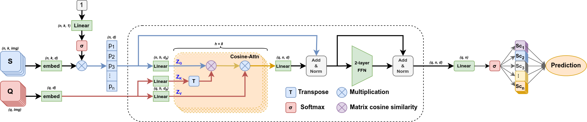

# Few-Shot TransFormer with Cosine Similarity

## Table of Content
- [Few-Shot TransFormer with Cosine Similarity](#few-shot-transformer-with-cosine-similarity)
  - [Table of Content](#table-of-content)
  - [Abstract](#abstract)
  - [Experiments](#experiments)
    - [Dependencies environment](#dependencies-environment)
    - [Dataset](#dataset)
    - [Running scripts](#running-scripts)
  - [Results](#results)
  - [References](#references)
  - [Acknowledgment](#acknowledgment)
## Abstract
> In this work, we proposed a few-shot image classification algorithm using Attention-based Transformer algorithm named Few-Shot TransFormer (FS-TF). In our few-shot architecture, we propose a new attention mechanism named Cosine Attention, which achieved a more robust, better performances in the comparison with the standard Softmax Self-Attention in many scencarios. With our proposed method, we achieved a competitive performance on 3 datasets _mini_-ImageNet, CUB-200, and CIFAR-FS on 5-way 1-shot and 5-way 5-shot settings.

*Our proposed FS-TF method with Cosine Attention mechanism*

## Experiments
### Dependencies environment
```
  torch v1.10.2+cu113
  CUDA 11.6
  torchvision 0.11.3+cu113     #installed along with Torch
  openCV-python 4.5.5.62
  einops
  numpy
  pdb
  matplotlib
  PIL
  json
  wandb
```
### Dataset
+ **_mini_-ImageNet**:  
  + Go to `/dataset/miniImagenet/`
  + Download the dataset from `download_miniImagenet.txt`
  + Run `source download_miniImagenet.sh` for processing dataset.
  + When complete, there are three JSON files `base.json`, `val.json`, and `novel.json` for experiments
+ **CUB**:
  + Go to `/dataset/CUB/`
  + Processing data similar to **mini**-Imagenet dataset
+ **CIFAR**:
  + Go to `/dataset/CIFAR_FS/`
  + Processing data similar to **mini**-Imagenet dataset
+ **Omniglot**:
  + Go to `/dataset/Omniglot/`
  + Run `source download_Omniglot.sh`
+ **Yoga**:
  + This is our custom dataset with 2480 images divided into 50 yoga pose categories, including 50 categiores for training, 13 for validating, and 12 for testing
  + Go to `/dataset/Yoga/`
  + Run `source yoga_processing.sh`
 ### Running scripts
+ **Python scripts**
  - Testing only: `test.py` (does not support WandB )
  - Training and testing: `train_test.py`
+ **Configurations pool**:
    + Backbones: `Conv4`/`Conv6`/`ResNet18`/`ResNet34`
    + Methods: `FSTF_softmax`/`FSTF_cosine`/`CTX_softmax`/`CTX_cosine`
    + Dataset: `miniImagenet`/`CUB`/`CIFAR`/`Omniglot`/`Yoga`
+ **Main parameters**:
  - `--backbone`: backbone model (default `ResNet34`)
  - `--feti`: Using FETI (ResNet pretrained on ImageNet subset to avoid overlap) for ResNet Backbone if `1`, none if `0` (default `0`)  
  - `--method`: few-shot method algorithm (default `FSTF_cosine`)
  - `--n_way`: number of catergories for classification (default `5`)
  - `--k_shot`: number of shot per category in Support set (default `5`)
  - `--n_episode`: number of training/validating episodic batch per epoch
  - `--train_aug`: apply augmentation if `1`, none if `0` (default `0`)
  - `--num_epoch`: number of training epoch (default `50`)
  - `--wandb`: saving training log and plot visualization into WandB server if `1`, none if `0` (default `0`)

  - For other parameters, please read `io_utils.py` for detail information.
+ **Example**:  
  `python train_test.py --method FSTF_cosine --dataset miniImagenet --backbone ResNet34 --FETI 1 --n_way 5 --k_shot 5 --train_aug 0 --wandb 1`  
+ **Bash script for multiple running**:
  + `source run_script.sh`
  + Parameters can be modified within the script for specific experiments, including dataset, backbone, method, n_way, k_shot, augmentation
  + All the method automatically push the training loss/val logs into WandB server. Set `--wandb 0` to turn it off
+ Result logs after testing will be saved in `record/results.txt`
## Results
Our method Few-Shot TransFormer achieves the following performances on:
| Dataset        | 1-shot Accuracy  | 5-shot Accuracy |
| ---------------|---------------|--------------|
| *mini*-ImageNet|  55.87+-0.86% | 73.42+-0.67% |
| CIFAR-FS       |  67.06+-0.89% | 82.89+-0.61% |
| CUB            |  81.23+-0.77% | 92.25+-0.37% |

All detail results are saved in `record/official_results.txt`

## References
+ [A Closer Look at Few-shot Classification (ICLM 2019)](https://arxiv.org/abs/1904.04232)
+ [CrossTransformers: spatially-aware few-shot transfer (NeurIPS 2020)](https://arxiv.org/abs/2007.11498)
## Acknowledgment
+ This repository is mainly based on **"A Closer Look at Few-shot Classification"** official GitHub Repository: [wyharveychen/CloserLookFewShot](https://github.com/wyharveychen/CloserLookFewShot)
+ The CrossTransformer CTX implemented code in this repository is modified from [lucidrains/cross-transformers-pytorch](https://github.com/lucidrains/cross-transformers-pytorch)